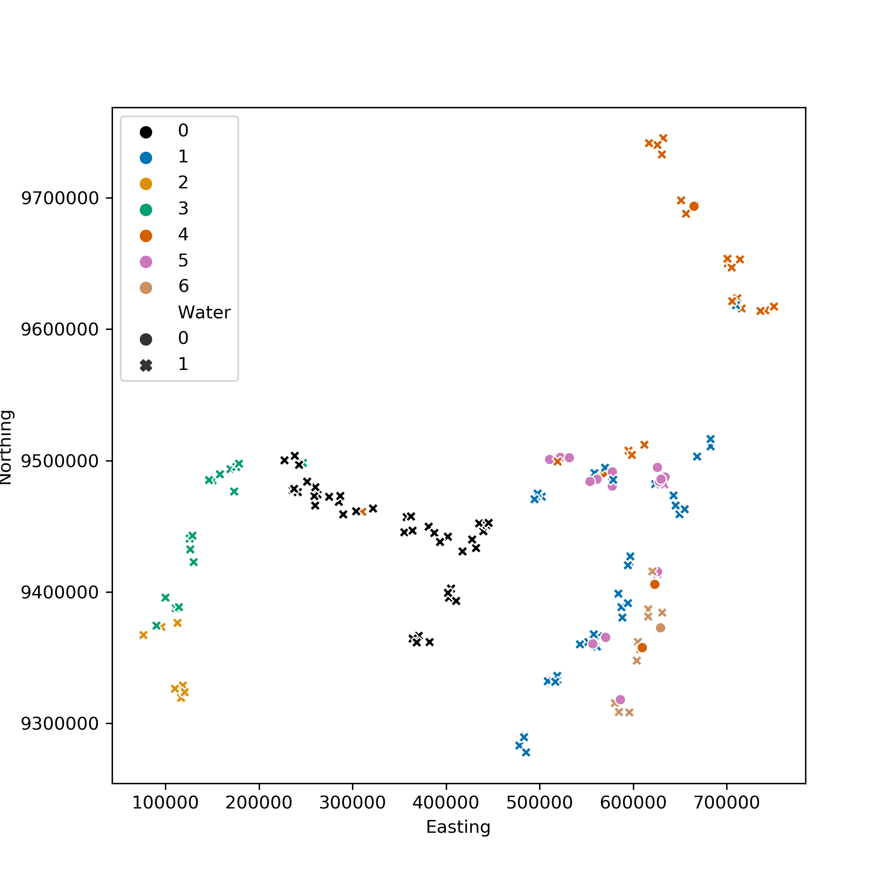
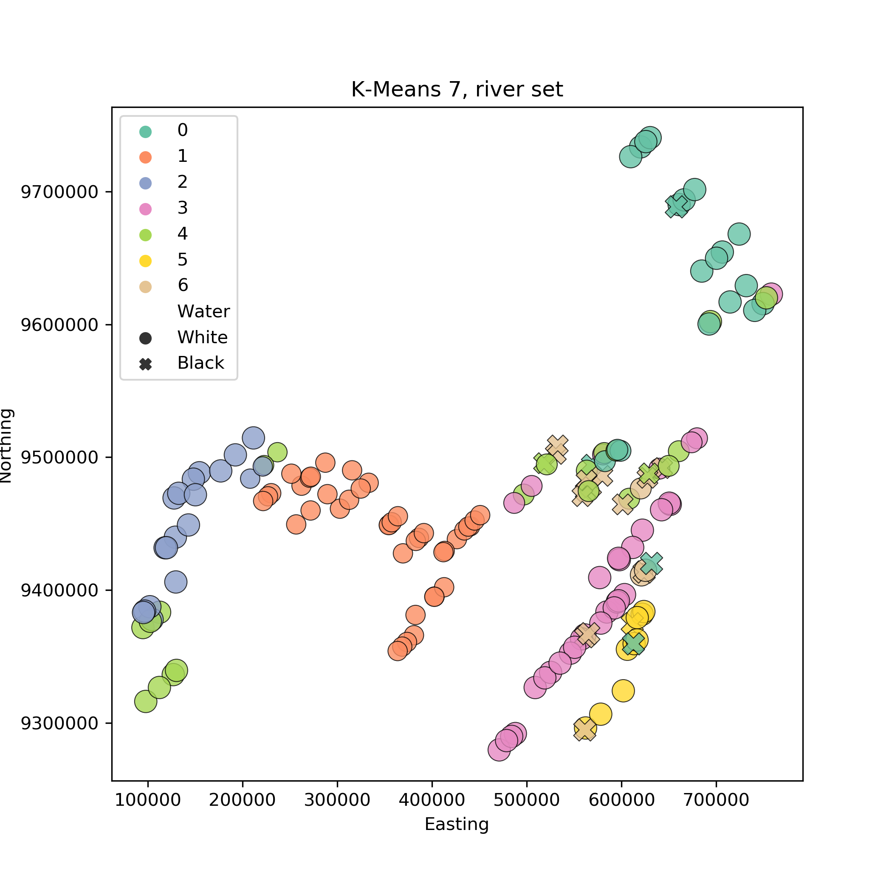

## Spectral Clustering
Using Spectral clustering with 7 clusters, and first degree polynomial applied to river css log. 
it has a rand index score of 0.534, one of the best we found.

## K-means clustering 
K-means clustering with 7 clusters applied to riverdfcsslog dataset.
Rand index is at 0.526 which is good.
 
If we use the same technique with river and river Css we get much worse results.
 
 
## Affinity Propagation clustering {{site.baseurl}}
Affinity propagation clustering with -6000 preference and 0.86 damping applied to riverdfcsslog dataset.
Rand index is at 0.42 which is okayish.
Affinity propagation does not know the number of cluster from before hand and tries to figure them out
 depending on its parameters. Each sample communicates with all others and tries to become the representative
of a cluster. The preference changes how easily samples can joing others' clusters.
 
 

If we use the same technique with river and river Css we get random allocation.
The preference has to be set selected from before hand, and an apriori way has to be developed
to do so. Eg using the median of the similarity matrix, which depends on the scae of points. 
We could restate the problem as an optimisation one to select the parameters that produce the best 
Rand index, but that would go against the principle of unsupervised machine learning
