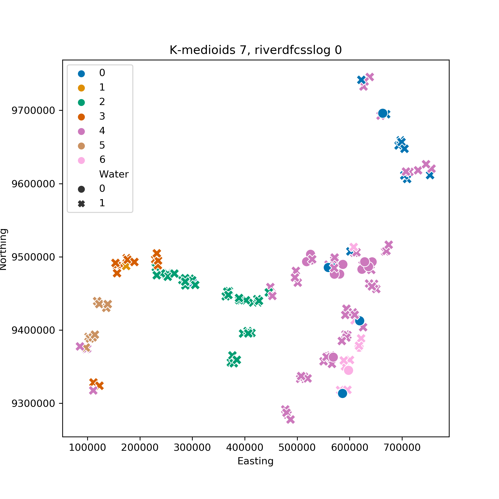

[Back to Index](index.md)
# Unsupervised Machine Learning
## Clustering
The essential difference between supervised and unsupervised machine learning is that the former requires some sort of target or labels, and the aim is to establish a link between the features (OTU counts in our case) and those targets. Unsupervised on the other hand involves the exploration of just the features and how they are dis/similar. 

There are various algorithms used to uncover hidden patterns in data that make different assumptions about them or go about finding patters using different approaches. Furthermore, some algorithms have a random component in they way they work (like NMDS in ecology), thus each run, depending on the parameters chosen, might produce different results. If however, a general pattern emerges consistently over runs and algorithms then it can be assumed with some degree of confidence that there is something in the data causing it.

Unsupervised methods usually aggregate points into clusters which denote some form of similarity between the members. Most of these algorithms partition the data rather than cluster them, with the difference being that partition aims at including every point in a group where as true clustering might leave some points behind as outliers.

Another important aspect of this exploratory analysis is the parameters used to tune the algorithms. Some of them require from beforehand the number of clusters (partitions is more appropriate) to be found in the data. In our case, where we know that the labels might be some sort of grouping based on the location or water colour, the number of clusters that are of interest range from 2 to 7. We should be mindful that setting from beforehand the number of clusters we want to see in the data introduces some sort of bias in our analysis; we know what we want to see and have essentially told the algorithm to look for it. Other methods have different parameters that need tuning, some more intuitive than others and less dependent on the targets (so more "unsupervised"). The further away the interpretation of parameters is from our targets, the more "exploratory" and "a priori" our analysis.

An issue of clustering when it comes to high-dimensional data is the interpretation and presentation of results. We could for example use our target classes and see how close the unsupervised algorithm came to the "truth". There are indices that can measure this similarity, like the Rand Index which ranges from 0 to 1 as the two groupings get more similar. Another way is to plot the data in 2 or 3 dimensions of some features or some combinations of features (after dimensionality reduction). Finally, we could use some other metadata (like location in our case) to plot the data and colour them according to cluster membership.

## Results

We plot the results in Northing-Easting coordinates and denote the different clusters with colour, and the black and white water samples with a circular and cross shape.

### K-means clustering 
K-means works by assigning points to the nearest randomly generated cluster center. The number of centroids is predetermined by the user. 
K-means clustering with 7 clusters applied to riverdfcsslog dataset.
Rand index is at 0.526 which is good.
 
If we use the same technique with river and river Css we get much worse results.
 
 

We can also use 2 clusters as a parameters, but the algorithm doesn't separate between black and white but rather above and bellow the pongo.
 

### K-medioids
Works in a similar manner to k-means but instead of generated centroids, the user picks some initial points which are used as centers. Also, the new center of the cluster is picked based on the lower median score between members of the clusters rather than the lower mean score of the members.

Running the algorithm for 2 clusters produces this graph which groups mid maranon and tapiche in their own cluster.

Using 7 clusters the algorithm groups again the mid rivers. The graph produced from a random initialisation is given below.

[More random initialisations of 7 cluster K-medioids](kmedioid.md)

### Spectral Clustering
Using Spectral clustering with 7 clusters, and first degree polynomial applied to river css log. 
It has a rand index score of 0.534, one of the best we found. As in Kmeans, the samples behind the pongo stand out as distinct from the others and are clustered in their own group (except some in the south west corner). Mid maranon and tapiche are grouped together as well, as well as Napo samples between them. The others are found in the remaining groups. In general there seems to be some difficulty for the algorithms to separate between the eastern samples (excluding napo).

Choosing 2 clusters instead, this algorithm separates the upper maranon samples from the rest.

### Affinity Propagation clustering {{site.baseurl}}
Affinity propagation clustering with -6000 preference and 0.86 damping applied to riverdfcsslog dataset.
Rand index is at 0.42 which is okayish.
Affinity propagation does not know the number of cluster from before hand and tries to figure them out depending on its parameters. Each sample communicates with all others and tries to become the representative of a cluster. The preference changes how easily samples can join others' clusters.
 
 

If we use the same technique with river and river Css we get random allocation. The preference has to be set selected from before hand, and an apriori way has to be developed to do so. Eg using the median of the similarity matrix, which depends on the scale of points. We could restate the problem as an optimisation one to select the parameters that produce the best Rand index, but that would go against the principle of "a priori" exploration without targets.

## Conclusions
We can draw some conclusions from the results of the unsupervised approach. First of all, there seems to be some structure to the OTU count data that can be partially ascribed to their location. Samples grouped together spatially also tend to be grouped in their species compositions. Furthermore, there seems to be some strong cohesion between most upper maranon samples, and between mid maranon and tapiche. Unfortunately, water colour doesn't directly show up, but that might be because the white water group is very diverse (if you look at the NMDS plots of the samples and colour them by water colour you can see that there is some difference between the centers of the two groups and that the white water samples are very spread out). 