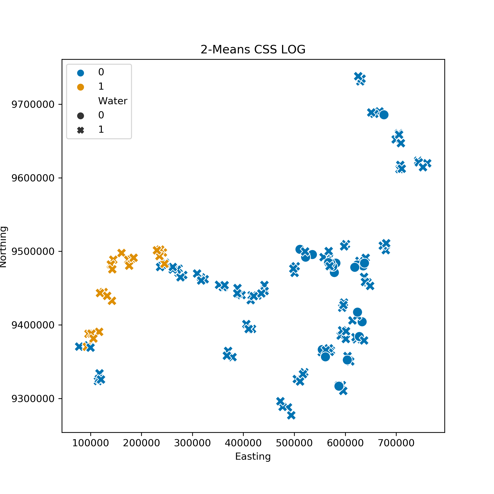
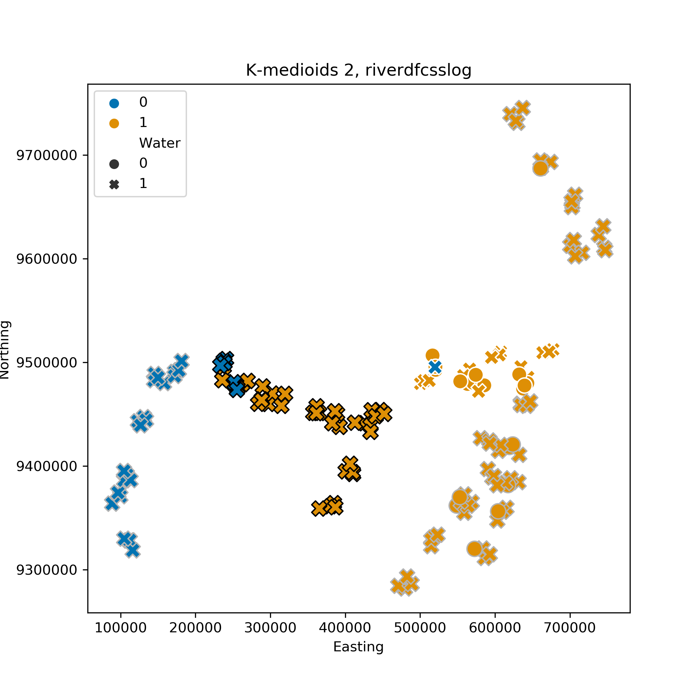

**Assumptions**: This draft makes some assumptions abouts its intended audience and about the content already presented in the previous part of the paper.  
**Audience**: The audience is not assumed to have any training in Machine Learning techniques or Mathematics for that matter.  
**Content**: The meta data are assumed to have been explained in a previous part of the paper. In particular, that we are sampling from a river, that we track location of the samples and that they broadly belong to 7 parts of the river {Upper, Mid, Lower Maranon, Tapiche, Huallaga, Ucayalli, Napo}, and that each sample comes from either black or white water.   
**Intentions**: This part acts as a motivation for the use of machine learning methods with ecological data. 
# Machine Learning on OTU count data
The OTU counts and meta data per sample provide us with an excellent opportunity to try some mainstream Machine Learning (ML) methods and evaluate their usefulness in the ecological setting. These fall under two categories; supervised and unsupervised learning. The former requires some sort of target or labels, and the aim is to establish a link between the features (OTU counts in our case) and those targets. Unsupervised is more of an exploratory approach that does not use target variables, and one of its aims is uncovering relationships and patterns between samples.

As is the case for a lot of ML experiments, the performance of the algorithms can be greatly improved by transforming the feature data. We have found that applying a cumulative-sum-scaling normalisation and subsequent log transformation improved the results for most applications[Paulson 2013](https://www.ncbi.nlm.nih.gov/pmc/articles/PMC4010126/). Furthermore, standard scaling (centering and scaling the features to unit variance) has proved to be useful for some algorithms.
## Unsupervised
The unsupervised methods presented fall under the category of clustering; samples are grouped together based on their features and how similar or not they are to each other. Each algorithm has a different way of creating groups that involves different assumptions about the structure of the data. In a true exploratory analysis setting, where meta data are absent, we would be limited in evaluating the importance of a clustering result. In our case, however, we can use information on the location and water type of samples to evaluate the ability of the algorithms to extract true patterns from the data. 

Clustering algorithms require some parameters to be set by the user which, depending on how intuitive they are and what knowledge one has of their data, can be hard to do without braking the exploratory analysis framework. For example, KMeans, an algorithm that forms groups of samples by minimising the intergroup distances between samples, needs to know the number of partitions from the get go. If we did not have any other information other than the OTU counts it would be a difficult parameter to set. Here we will be presenting the most interesting results found by the algorithms, and provide all other tries in the Supplementary information.

A clustering of 2 groups performed using KMeans clustered the data on location rather than water colour. You can see in the following figure, where samples were plotted using their northing and easting coordinates, that the algorithm separated the sampler before the pongo from those after it, except some on the south western part.  
   
Using KMedioids, a variant of KMeans that forms clusters around actual points rather than generated ones and that tries to minimises inter group median distance from the centeroid rather than the mean, produces a clustering based on location as well. This algorithm, however, separates the middle part of the river (Mid Maranon and Tapiche) from the rest.  
  

There are various algorithms used to uncover hidden patterns in data that make different assumptions about them or go about finding patters using different approaches. Furthermore, some algorithms have a random component in they way they work (like NMDS in ecology), thus each run, depending on the parameters chosen, might produce different results. If however, a general pattern emerges consistently over runs and algorithms then it can be assumed with some degree of confidence that there is something in the data causing it.

# Notes
unsupervised and supervised ml, what they are -> UML finding patterns in data -> pattern finding example using kmeans ->problem with kmeans and choosing clusters from beforehand so a bit ad hoc, present 6 figures with cluster 2 to 7 (maybe in supplementary)-> present more appropriate exploration algorithm hdbscan-> see if we can predict -> explain how perdictions work, small summary of supervised ->use water, achieve good accuracy with n algorithm show picture. -> What else can we predict-> size of rivers and black water, ok results -> -> new labels and new classification
