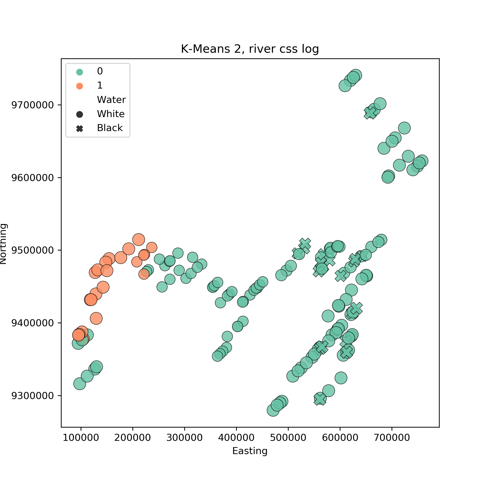

**Assumptions**: This draft makes some assumptions abouts its intended audience and about the content already presented in the previous part of the paper.  
**Audience**: The audience is not assumed to have any training in Machine Learning techniques or Mathematics for that matter.  
**Content**: The meta data are assumed to have been explained in a previous part of the paper. In particular, that we are sampling from a river, that we track location of the samples and that they broadly belong to 7 parts of the river {Upper, Mid, Lower Maranon, Tapiche, Huallaga, Ucayalli, Napo}, and that each sample comes from either black or white water.   
**Intentions**: This part acts as a motivation for the use of machine learning methods with ecological data. 
**Narative**: Ecosystem healthlink with fresh water ingeneral
# Machine Learning on OTU count data
The OTU counts and meta data per sample provide us with an excellent opportunity to try some mainstream Machine Learning (ML) methods and evaluate their usefulness in the ecological setting. These fall under two categories; supervised and unsupervised learning. The former requires some sort of target or labels, and the aim is to establish a link between the features (OTU counts in our case) and those targets. Unsupervised is more of an exploratory approach that does not use target variables, and one of its aims is uncovering relationships and patterns between samples.

As is the case for a lot of ML experiments, the performance of the algorithms can be greatly improved by transforming the feature data. We have found that applying a cumulative-sum-scaling normalisation and subsequent log transformation improved the results for most applications[Paulson 2013](https://www.ncbi.nlm.nih.gov/pmc/articles/PMC4010126/). Standard scaling (centering and scaling the features to unit variance) proved to be useful for some (linear) algorithms. In addition, the taxonomy of OTU data, where available, can be used to create subsets of the full OTU table. We have created a river set which includes only the OTUs that have been taxonomically identified and inhabit the river. In this way we can test whether just the river inhabiting OTUs have as much predictive power as the full set.
## Unsupervised
The unsupervised methods presented fall under the category of clustering; samples are grouped together based on their features and how similar or not they are to each other. Each algorithm has a different way of creating groups that involves different assumptions about the structure of the data. In a true exploratory analysis setting, where meta data are absent, we would be limited in evaluating the importance of a clustering result. In our case, however, we can use information on the location and water type of samples to evaluate the ability of the algorithms to extract true patterns from the data. 

Clustering algorithms require some parameters to be set by the user which, depending on how intuitive they are and what knowledge one has of their data, can be hard to do without braking the exploratory analysis framework. For example, KMeans, an algorithm that forms groups of samples by minimising the intergroup distances between samples, needs to know the number of partitions from the get go. If we did not have any other information other than the OTU counts it would be a difficult parameter to set. Here we will be presenting the most interesting results found by the algorithms, and provide all other tries in the Supplementary information.

A clustering of 2 groups performed using KMeans grouped the data based on location rather than water colour. You can see in the following figure, where samples were plotted using their northing and easting coordinates, that the algorithm separated the samples before the pongo from those after it, except some on the south western part. This result was obtained using CSS normalisation and log transformation on the river set data set. The full set produces a similar partition.
  

Choosing 7 clusters instead of 2 gives us an interesting separation of parts of the rivers. The algorithm seems to be partitioning the river into geographical parts. Using the full set produces very similar results. 
   
If instead we do not apply either the CSS normalisation or the log transformation the partitionings produced are not very interesting.    
   
   

Using KMedians, a variant of KMeans that forms clusters by minimising the inter group median distance from the centeroid rather than the mean, produces a partition based on location as well. It separates the Upper maranon from the rest of the parts as well.  Using the full set, creates a different grouping; upper maranon samples are in the same  partition as those from mid maranon and tapiche
    
  
  
that forms clusters around actual points rather than generated ones and that tries to minimises inter group median distance from the centeroid rather than the mean,

There are various algorithms used to uncover hidden patterns in data that make different assumptions about them or go about finding patters using different approaches. Furthermore, some algorithms have a random component in they way they work (like NMDS in ecology), thus each run, depending on the parameters chosen, might produce different results. If however, a general pattern emerges consistently over runs and algorithms then it can be assumed with some degree of confidence that there is something in the data causing it.

## Supervised Learning
As mentioned earlier, supervised methods require target data to be used for prediction. Suitable variables which were collected for each sample include water colour and the part of the river which they were sourced from. 

These variables act as a proof of concept; if we can predict aspects like location and water colour from OTU counts, then it might be possible to predict a health degradation index given the same type of data.
# Notes
unsupervised and supervised ml, what they are -> UML finding patterns in data -> pattern finding example using kmeans ->problem with kmeans and choosing clusters from beforehand so a bit ad hoc, present 6 figures with cluster 2 to 7 (maybe in supplementary)-> present more appropriate exploration algorithm hdbscan-> see if we can predict -> explain how perdictions work, small summary of supervised ->use water, achieve good accuracy with n algorithm show picture. -> What else can we predict-> size of rivers and black water, ok results -> -> new labels and new classification
