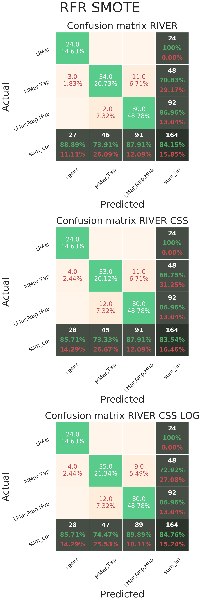

# Supervised Machine Learning
We chose  sets of target variables for the supervised  approach. Water colour, A combination of river areas and colour, and a pure area one. There are two water colours, and 7 major river areas. We also used two feature sets (OTU tables); one with only river inhabiting species and one with all of them, including those not taxonomically assigned to any species. 

## Water colour
The target variables in this instance are the colour of the river each sample is found in. Of the 164 samples, 21 are in Black water and 143 in White. This is a significance class imbalance, especially given our data set. 

The procedure was carried out as follows:  
* The train and test sets were split based on the area of the river each sample belonged to; 6 of the areas were used for training and the one left out for testing.  
* The 6 folds were then used for cross validation, to select the best hyperparameters of the classifier, using the same method; 5 folds were used for training and 1 for validation.  
* The cross validation step loops through all folds such that they play the role of validation once.  
* The whole procedure is repeated until all folds are used for testing.  

This is called the dissimilarity setting, and it simulates the performance of a classifier when it comes to predicting water colour of samples found in a whole new area of the river.

A similarity setting was also devised with accuracy results north of 98%.

The best scores for the dissimilarity setting were obtained using naive bayes, a very simple and fast algorithm, in combination with the river dataset after css normalisation and log transformation (96.3%). A confusion matrix with results can be seen here

Very good scores around 93% were obtained using SVM and river css log as well as full css log 100s (with some OTUs and samples removed because of very small total read counts) and with Logistic regression and L2 penalty.

Accuracy scores around 90% were obtained by Random Forest and Logistic Regression L1 as well.

Most mistakes were done towards misclassifying black water samples, thus some good sounding scores, like 87%, might be achieved by classifying everything as white. That's why a confusion matrix is an essential tool in reporting results.

## Rivers and black water
The samples in this case are grouped based on the size of rivers they come from and whether they come from black water. They belong in these classes: (Black/Mid, Low Maranon, Ucayalli/ Napa, Tapiche, Huallaga/ Upper Maranon).

The train and test sets are split in such a way that the distribution of samples found in each class is constant between each set. For example the split is performed such that black water samples make up 13% of both the train and test sets.

The best classifier, Logistic L1, achieved 82% using the full data set (with css log and 100s). The next two had accuracy scores of 81.7% (SVM full css log) and 80.5% (Logistic L2 full css log). The results aren't as exceptional as the previous case, however, we should note that this is a harder problem (4 classes instead of two and the same number of samples).

What these experiments showed was that scalers could be used to speed up and improve the classification for some estimators (SVM and Logistic in particular).

## Location only 
The labels are based only on the location of the samples, and split the river into three parts: West (Upper Maranon), Mid (Mid Maranon, Tapiche), and East (Lower Maranon, Huallaga, Ucayialli, Napo).

The same split procedure as the one used for the "Rivers and black water" is employed to split into train and test.

Before going into the results, the concept of resampling, or over-sampling, should be explained. In cases were the number of samples is very small, we can use some methods that produce new data points to be used for training. The way the new points are produced can either be by random resampling the non-majority class (picking a random sample belonging to one of the non-majority classes and appending it in the train set until all classes have th same number of samples) or a more complicated procedure (SMOTE or ADASYN) that might involve missclassification as a criterion.

For these targets the best classifier proved to be Random Forest achieving 85.36% with the river (css log) data set and with the use of a resampler. Without any resampling involved Random Forest obtains its highest accuracy score (81.7%) using the river data set. The highest accuracy scores were obtained using Random Forest and different combinations of resampling and river data sets.

Therefore, we can assume that even with OTU count data which are generally hard to model, resampling can work favorably in a classification setting. Further significance settings should be performed to established the p-value of each over-sampling method, but thus far it seems that it is useful. 

